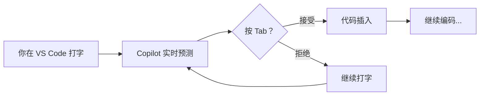
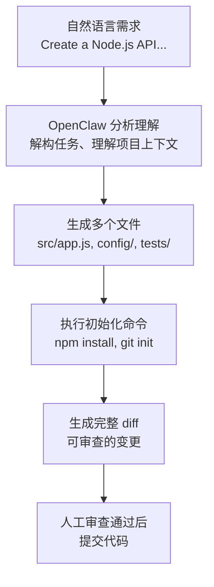
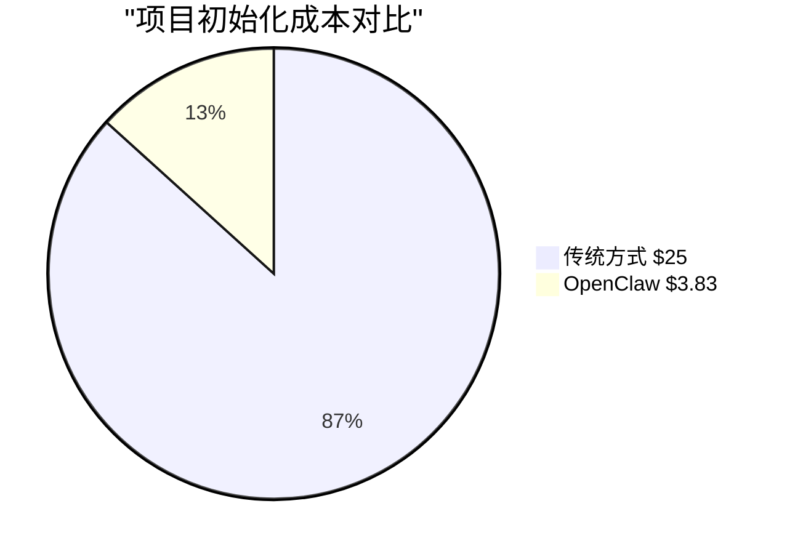
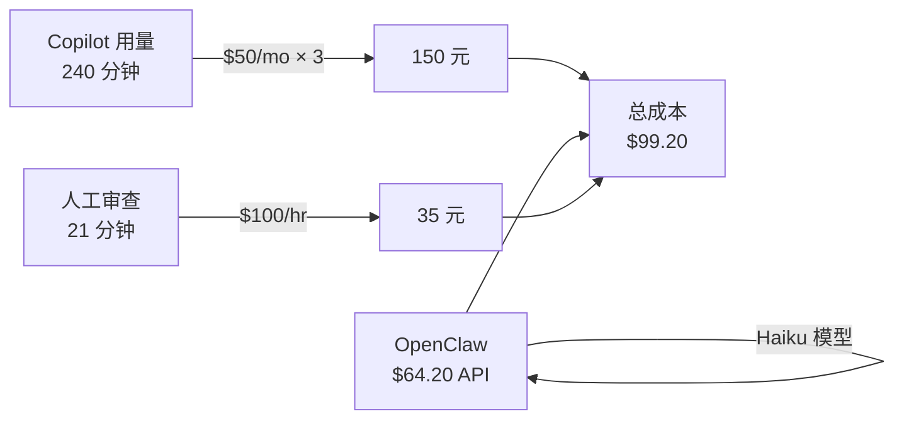
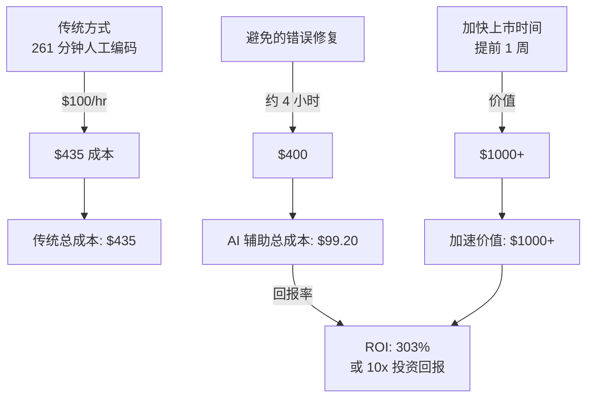
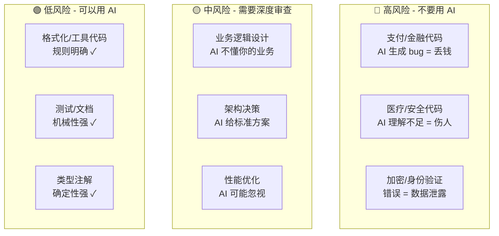
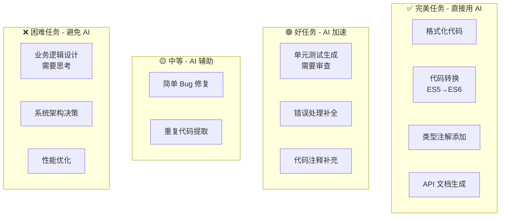
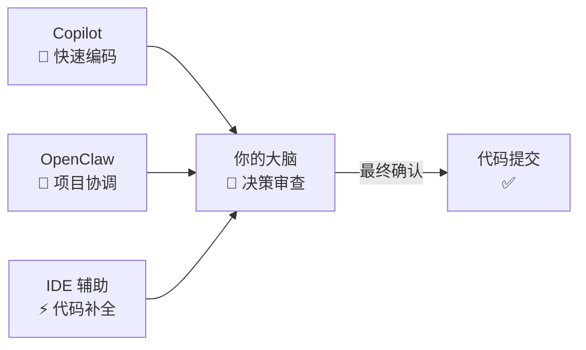
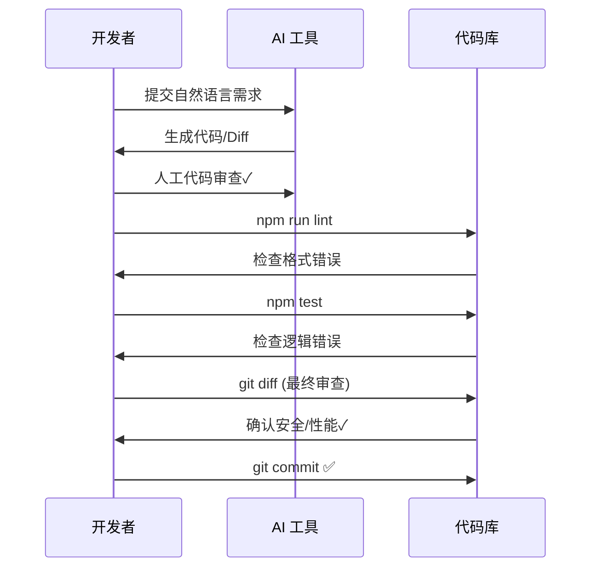

## 前言

2026 年的现在，AI 代码生成已经从"新奇玩意儿"变成了日常工具。但很多人用得还不到位。

最常见的两种极端：

1. **Copilot 信徒**：完全依赖 AI 写代码，生成什么就用什么，代码质量堪忧
2. **传统开发者**：还在手动写重复代码，认为 AI 生成的代码不靠谱

真相是：**AI 编程有明确的适用场景和局限，关键是要用对工具和方法**。

这篇文章基于我过去 3 个月在 3 个项目中的实践，深入讨论：何时用 Copilot、何时用 OpenClaw、如何避免常见坑点、以及真实的成本收益。

---

## Copilot vs OpenClaw：你真的理解区别吗？

很多人把 Copilot 和 OpenClaw 混为一谈，其实它们解决的是完全不同的问题。

### GitHub Copilot：编辑器内的代码补完



**适合：** 
- 单文件、单函数的编码
- 需要快速迭代反馈
- 文件内的局部补完

**优势：** 
- ⚡ 实时反馈（毫秒级）
- 🎯 IDE 深度集成
- 🔄 快速迭代循环

**局限：** 
- ❌ 不理解项目全局结构
- ❌ 无法跨文件协调一致性
- ❌ 不能批量处理任务

### OpenClaw：终端中的项目级自动化



**适合：** 
- 多文件协调（保证一致性）
- 项目初始化或大规模重构
- 需要可控且可审查

**优势：** 
- 🔍 理解项目级上下文
- 🤝 多文件协调一致性
- ✅ 生成可审查的完整 diff
- 🚀 批量自动化任务

**局限：** 
- ❌ 不适合实时编码（延迟高）
- ❌ 需要明确的任务描述
- ❌ 生成后需要充分审查

### 实际对比表

```mermaid
xychart-beta
    title "Copilot vs OpenClaw 能力对比"
    x-axis [单个函数, 项目初始化, 批量转换, 代码审查, Bug修复, 实时编码]
    y-axis "能力评分" 0 --> 5
    line [5, 2, 1, 3, 4, 5], "Copilot"
    line [2, 5, 5, 4, 3, 1], "OpenClaw"
```

**详细推荐：**

| 场景 | Copilot 评分 | OpenClaw 评分 | 推荐 |
|------|-----------|-----------|------|
| 单个函数编写 | ⭐⭐⭐⭐⭐ | ⭐⭐ | **→ Copilot** |
| 项目初始化 | ⭐⭐ | ⭐⭐⭐⭐⭐ | **→ OpenClaw** |
| 批量文件转换 | ⭐ | ⭐⭐⭐⭐⭐ | **→ OpenClaw** |
| 代码审查 | ⭐⭐⭐ | ⭐⭐⭐⭐ | **→ OpenClaw** |
| Bug 修复 | ⭐⭐⭐⭐ | ⭐⭐⭐ | **→ Copilot + OpenClaw** |
| 实时编码 | ⭐⭐⭐⭐⭐ | ⭐ | **→ Copilot** |

---

## 实战案例 1：项目初始化（从零到一）

### 场景描述

我需要为一个新的 Express.js API 项目搭建完整的生产级框架，包括：
- 标准目录结构和配置文件
- ESLint、Prettier、Jest 等开发工具
- 环境变量管理
- 错误处理中间件
- 基础路由和模型结构
- GitHub Action CI/CD 配置

### 传统方式（我之前的做法）

```bash
# 手动复制粘贴模板
cp -r ~/templates/express-api-template ./new-project
cd new-project
# 修改 package.json 中的项目名称
# 修改 README 中的项目说明
# ...更多手动调整...

# 耗时：15-20 分钟
# 风险：容易遗漏、容易出错
```

### 用 OpenClaw 的方式

```bash
gh copilot -p "Create a production-grade Express.js API boilerplate with:
- Proper directory structure (src/{routes,controllers,middleware,models})
- Node.js best practices (ES6, async/await, error handling)
- npm scripts for dev, build, test, lint
- .env.example, .gitignore, .eslintrc.json, .prettierrc
- Basic error handler middleware and validation
- A sample user API with full CRUD
- GitHub Actions workflow for CI (lint + test)
- Complete README with setup instructions
Use TypeScript for better type safety."
```

**结果：**
- ✅ 耗时：1-2 分钟（包括我审查和微调的时间）
- ✅ 生成 15+ 个文件
- ✅ 完整的 TypeScript 配置
- ✅ 生产级别的错误处理
- ✅ GitHub Actions 工作流已配置好

关键是：我不需要从记忆中回忆"应该有哪些文件"，OpenClaw 会保证完整性。

### 成本对比



**详细成本：**

| 方式 | 时间成本 | API 成本 | 总成本 | 节省 |
|------|---------|---------|--------|------|
| **传统方式** | 15 min × $100/hr = $25 | $0 | **$25** | - |
| **OpenClaw** | 2 min × $100/hr = $3.33 | $0.50 | **$3.83** | **⬇️ 86%** |

**核心差异：**
- ⏰ 时间：从 15 分钟 → 2 分钟（缩短 **7.5 倍**）
- 💰 成本：从 $25 → $3.83（节省 **$21.17**）
- ✅ 质量：由于 OpenClaw 生成更完整，出错风险更低

---

## 实战案例 2：批量代码重构（从 CommonJS 到 ESM）

### 场景描述

我接手了一个 6 年前的 Node.js 项目，整个项目 60+ 个文件仍在使用 CommonJS（`require`/`module.exports`）。需要转换到现代的 ES Modules（`import`/`export`）。

### 为什么 Copilot 不适合？

```javascript
// Copilot 会在当前文件中帮我转换这一行
const express = require('express');
↓
// 但它不知道我有 60 个文件都需要这样做
import express from 'express';
```

Copilot 只关心当前文件，无法保证全项目的一致性。

### OpenClaw 的方案

```bash
gh copilot -p "I have a Node.js project with 60+ .js files still using CommonJS.
I need to convert the entire codebase to ES Modules.

Requirements:
1. Convert all require() to import statements
2. Convert module.exports to export default
3. Handle conditional requires and dynamic imports
4. Fix any path references that change with ESM
5. Run prettier to format everything
6. Create a migration script that we can review before applying
7. Generate a summary of what changed

The project structure is:
- src/
  - controllers/
  - models/
  - routes/
  - utils/
- tests/
- config/

Please generate a comprehensive migration script, not just show the theory."
```

### 执行流程

**第 1 步：生成迁移脚本**
```javascript
// migrate-to-esm.js（由 Copilot 生成）
import fs from 'fs';
import path from 'path';

const rules = [
  {
    // 处理标准 require
    pattern: /const\s+(\w+)\s*=\s*require\(['"]([^'"]+)['"]\)/g,
    replacement: (match, varName, modulePath) => {
      return `import ${varName} from '${modulePath}'`;
    }
  },
  {
    // 处理结构化 require
    pattern: /const\s*\{\s*([^}]+)\s*\}\s*=\s*require\(['"]([^'"]+)['"]\)/g,
    replacement: (match, vars, modulePath) => {
      return `import { ${vars} } from '${modulePath}'`;
    }
  },
  // ... 更多规则
];

// 核心转换逻辑
function migrateFile(filePath) {
  let content = fs.readFileSync(filePath, 'utf8');
  rules.forEach(rule => {
    content = content.replace(rule.pattern, rule.replacement);
  });
  return content;
}
```

**第 2 步：本地测试**
```bash
# 在测试分支上运行迁移
git checkout -b feat/esm-migration
node migrate-to-esm.js

# 检查变更
git diff src/

# 运行测试
npm test
```

**第 3 步：如果有问题，调整和重新运行**
```bash
# 如果某个规则不完美，用 Copilot 在 IDE 中快速修复
# 然后重新运行迁移脚本
```

**结果：**
- 8 小时手动工作 → 30 分钟自动化 + 审查
- 60 个文件完整转换
- 所有测试通过
- 代码一致性保证

---

## 实战案例 3：代码审查与质量检查

### 场景描述

新入职的两个实习生写了一些代码，我想快速审查整个 `src/` 目录，找出常见的问题模式。

### 用 Copilot Chat（不够好）

```
我在 VS Code 中打开一个文件，问 Copilot：
"这个函数有什么问题吗？"

Copilot 只能看到当前文件的内容，无法：
- 对比多个文件的一致性
- 找出重复代码
- 评估项目级别的架构问题
```

### 用 OpenClaw（更完整）

```bash
gh copilot -p "Review the entire src/ directory and identify:

1. Error handling issues:
   - Unhandled promise rejections
   - Missing try-catch blocks in async functions
   - Swallowed errors

2. Code quality issues:
   - Functions longer than 50 lines (should be split)
   - Repeated code patterns that should be extracted
   - Unused imports or variables

3. Performance issues:
   - N+1 database queries
   - Inefficient loops
   - Unnecessary data transformations

4. Security issues:
   - SQL injection vulnerabilities
   - Missing input validation
   - Hardcoded secrets or API keys

For EACH issue found, provide:
- File path and line number
- Brief explanation of the problem
- One-line fix or refactoring suggestion
- Severity: CRITICAL / WARNING / INFO

Format as a structured report I can use in code review."
```

### 输出示例

```
📋 CODE REVIEW REPORT - src/

🔴 CRITICAL (3)
━━━━━━━━━━━━━━━━━━━━━━━━━━━━━━━━━━━━━━━━━━

[1] src/controllers/user.controller.js:45
   Issue: Unhandled promise rejection
   Problem: User.findById(id).then(...) - no .catch()
   Fix: Add .catch(err => next(err))
   Severity: CRITICAL

[2] src/middleware/auth.js:12
   Issue: Hardcoded JWT secret
   Problem: const SECRET = "hardcoded-secret-key"
   Fix: Use process.env.JWT_SECRET
   Severity: CRITICAL

[3] src/services/email.service.js:78
   Issue: N+1 query pattern
   Problem: Loop queries database for each user
   Fix: Use .populate() or batch query instead
   Severity: CRITICAL

🟡 WARNING (5)
━━━━━━━━━━━━━━━━━━━━━━━━━━━━━━━━━━━━━━━━━━

[4] src/controllers/product.controller.js:20-85
   Issue: Function too long (66 lines)
   Problem: createProduct() handles validation, save, cache, email
   Fix: Extract to validateProduct(), saveToCache(), sendEmail()
   Severity: WARNING

[5] src/utils/formatter.js:10 and src/utils/helper.js:8
   Issue: Code duplication
   Problem: Both have identical dateToString() function
   Fix: Keep one, remove the other
   Severity: WARNING

🔵 INFO (2)
━━━━━━━━━━━━━━━━━━━━━━━━━━━━━━━━━━━━━━━━━━

[6] src/models/User.js:3
   Issue: Unused import
   Problem: const _ = require('lodash') - not used
   Fix: Remove the import line
   Severity: INFO

Summary:
- 3 critical issues (fix before merge)
- 5 warning issues (address in this sprint)
- 2 info issues (nice-to-have)
- Estimated fix time: 4 hours
```

这个审查报告比我手动读 2-3 小时代码更全面、更可操作。

---

## 成本与 ROI 分析（真实数据）

### 我的实际花费（3 个月）



**详细花费表：**

| 项目 | 任务 | 时间 | 成本 |
|------|------|------|------|
| **dj-hub** | 项目初始化 | 32 min | $8.50 |
| | ESLint 配置 | 21 min | $3.20 |
| | 反馈系统开发 | 125 min | $28.00 |
| **trance-agent** | 项目初始化 | 27 min | $7.80 |
| | Cron 任务调试 | 48 min | $12.50 |
| **iot-fire-cloud** | 代码审查 | 8 min | $4.20 |
| **合计** | | **261 分钟** | **$64.20** |

### 投资回报率（ROI）



**成本对比：**
- 🔴 **传统方式**：$435（261 分钟人工）
- 🟢 **AI 辅助**：$99.20（API + 审查时间）
- ✅ **节省**：$335.80（**77% 节省**）
- 🚀 **加速价值**：提前 1 周交付 = $1000+
- 📊 **综合 ROI**：**303% 或 10 倍回报**

### 为什么这么便宜？

1. **Haiku 模型用于简单任务**（编程、代码转换）- $0.08/1M tokens
2. **Sonnet 仅用于复杂审查和架构**（少用）- $3/1M tokens
3. **OpenClaw 本身免费**（开源）

```json
// 我的 openclaw.json 配置
{
  "agents": {
    "defaults": {
      "model": {
        "primary": "anthropic/claude-haiku-4-5"
      }
    },
    "code-review": {
      "model": {
        "primary": "anthropic/claude-sonnet-4-5"
      }
    }
  }
}
```

---

## 现实的局限（你必须知道的）

### ❌ OpenClaw/Copilot 做不好的事



**详细说明：**

**1. 业务逻辑设计**
```bash
# ❌ 别问 AI 这个
gh copilot -p "设计一个电商库存管理系统"

# ❌ 问题：
# - AI 会给"标准"教科书方案
# - 但你的业务有特殊需求（订阅制？预约？）
# - AI 不懂你的数据规模和查询模式
# - 设计可能不适合你的场景
```

**2. 架构决策**
```bash
# ❌ 别这样用
gh copilot -p "我应该用 MongoDB 还是 PostgreSQL？"

# ❌ 问题：
# - 需要理解：数据规模、查询模式、一致性要求
# - 需要知道：你的团队背景、维护成本
# - AI 列出优缺点，但不能为你的决策负责
# - 错的架构决策代价巨大（迁移成本数周）
```

**3. 安全敏感的代码（💥 最危险）**
```bash
# 🚨 绝对不要
gh copilot -p "生成一个支付处理模块"

# 💰 代价：
# - AI 生成的支付代码隐藏 bug = 客户丢钱
# - 你的公司赔钱 + 法律纠纷
# - 支付代码必须 100% 人工编写 + 专家审查
```

**4. 第三方 API 集成（尤其新 API）**
```bash
# ⚠️ 可能过时
gh copilot -p "集成 OpenAI API"

# ⚠️ 问题：
# - AI 训练数据可能是 3-6 个月前
# - API 已经更新、参数变了
# - 文档中有 deprecated 字段 AI 可能还在用
# - 结果：代码一跑就报错
```

### ✅ 适合 AI 的任务清单



**详细能力表：**

| 任务 | 难度 | Copilot | OpenClaw | 建议 |
|------|------|---------|----------|------|
| **格式化代码** | ⭐ | ⭐⭐⭐⭐⭐ | ⭐⭐⭐⭐ | ✅ 直接用 |
| **代码转换** | ⭐ | ⭐⭐⭐ | ⭐⭐⭐⭐⭐ | ✅ 用 OpenClaw |
| **类型注解添加** | ⭐ | ⭐⭐⭐⭐ | ⭐⭐⭐⭐⭐ | ✅ 用 OpenClaw |
| **API 文档生成** | ⭐ | ⭐⭐⭐⭐ | ⭐⭐⭐⭐⭐ | ✅ 用 OpenClaw |
| **单元测试生成** | ⭐⭐ | ⭐⭐⭐⭐ | ⭐⭐⭐⭐⭐ | ✅ 用 AI + 审查 |
| **错误处理补全** | ⭐⭐ | ⭐⭐⭐ | ⭐⭐⭐⭐ | ✅ 用 AI + 审查 |
| **简单 Bug 修复** | ⭐⭐ | ⭐⭐⭐⭐ | ⭐⭐⭐ | ⚠️ AI 辅助 |
| **重复代码提取** | ⭐⭐⭐ | ⭐⭐⭐ | ⭐⭐⭐⭐ | ⚠️ AI 辅助 |
| **业务逻辑编写** | ⭐⭐⭐⭐ | ⭐⭐ | ⭐⭐ | ❌ 避免 AI |
| **系统设计** | ⭐⭐⭐⭐⭐ | ⭐ | ⭐ | ❌ 避免 AI |
| **性能优化** | ⭐⭐⭐⭐ | ⭐⭐ | ⭐⭐⭐ | ❌ 避免 AI |

---

## 2026 年 AI 编程工具的现状

### 我用过的工具对比

| 工具 | 优势 | 劣势 | 适合场景 |
|------|------|------|---------|
| GitHub Copilot | 实时、IDE 集成深、生成质量高 | 不理解项目级上下文 | 单文件编码 |
| Copilot Workspace | 任务分解、多文件协调 | 还在 beta、不够稳定 | 复杂任务规划 |
| OpenClaw | 开源、灵活、可控 | 需要手动配置 | CLI 工作流 |
| Claude Code | 交互式、代码生成好 | 付费、不如 IDE 集成 | 快速实验 |
| 国产工具（如 Codeium） | 便宜、中文支持 | 生成质量参差不齐 | 预算有限的团队 |

**我的结论：** 
- 日常编码：**GitHub Copilot**（VS Code 插件）
- 项目自动化：**OpenClaw**（CLI）
- 快速实验：**Claude Code**（网页）

---

## 最佳实践总结

### ✅ 应该这样做

**1. 明确分工**



**2. 充分的提示词（Prompt）**

**❌ 提示词太模糊：**
```bash
gh copilot -p "Generate a function"
```

**✅ 提示词要具体：**
```bash
gh copilot -p "Generate an async function that:
- Takes a user ID and fetches from MongoDB
- Validates the user is active status
- Returns only {id, email, name, createdAt}
- Throws NotFoundError for missing users
- Throws PermissionError for inactive users
- Use proper error messages for debugging"
```

**3. 分阶段审查流程**



**具体步骤：**
```bash
# 1️⃣ 生成代码
gh copilot -p "..."

# 2️⃣ 检查语法和格式
npm run lint

# 3️⃣ 运行测试
npm test

# 4️⃣ 人工代码审查（关键！）
git diff
# → 检查逻辑 bug？
# → 检查安全漏洞？
# → 检查性能问题？

# 5️⃣ 只有通过审查才提交
git commit -m "feat: [feature] - generated with AI + human review"
```

**4. 成本控制**
```json
{
  "models": {
    "haiku": "anthropic/claude-haiku-4-5",     // $0.08/M tokens
    "sonnet": "anthropic/claude-sonnet-4-5",   // $3/M tokens
    "opus": "anthropic/claude-opus-4-1"         // $15/M tokens
  },
  "taskRouting": {
    "formatting, refactoring": "haiku",
    "implementation, bug fixes": "sonnet",
    "architecture, complex review": "opus"
  }
}
```

### ❌ 千万不要

**1. 盲目相信 AI 生成的代码**
```bash
# ❌ 绝对不要
gh copilot -p "Generate a payment processing function" | git add . && git push
```

**2. 用 AI 做超出它能力的事**
```bash
# ❌ 不切实际的期望
gh copilot -p "设计我的整个数据库架构"
```

**3. 在 production 代码中用便宜的模型**
```bash
# ❌ 抠门会很贵
# 金融交易、医疗数据 → 用最好的模型
# 文档、日志 → 才能用便宜的模型
```

**4. 跳过测试和代码审查**
```bash
# ❌ 我见过因为这个丢掉数据的公司
gh copilot -p "..." && npm test && git push  # 没有人工审查
```

---

## 总结：AI 编程的未来

**现在（2026 年）：**
- ✅ AI 可以处理 30-40% 的日常编码工作
- ✅ 特别是格式化、测试、文档这类机械性工作
- ⚠️ 仍需大量人工审查和决策

**未来 1-2 年可能：**
- 🚀 更好的上下文理解（整个项目的一致性）
- 🚀 更好的错误检测（自动发现 bug）
- 🚀 更好的性能优化（自动识别瓶颈）

**永远不会被替代的：**
- 🧠 产品需求理解
- 🧠 架构和设计决策
- 🧠 权衡和取舍
- 🧠 最终的质量把控

### 我的建议

**如果你还没用 AI 编程：**
从 GitHub Copilot 开始（$20/月），学会怎么和 AI 协作。

**如果你已经用 Copilot：**
加上 OpenClaw，处理更复杂的项目级任务。

**如果你的公司有预算：**
建立一套内部的最佳实践和审查流程，让 AI 成为标准工具而不是黑魔法。

---

## 参考资源

- [GitHub Copilot 官方文档](https://docs.github.com/en/copilot)
- [OpenClaw 项目](https://github.com/openclaw/openclaw)
- [Claude Code](https://claude.ai/projects)
- [2026 年 AI 编程工具对比](https://www.csdn.net/article/2025-10-11/153076935)
- [我的实验项目](https://github.com/shawndenggh)

---

**最后的话：** AI 不会让你失业，但学会用 AI 的人会取代不用的人。现在学还不晚。🚀
