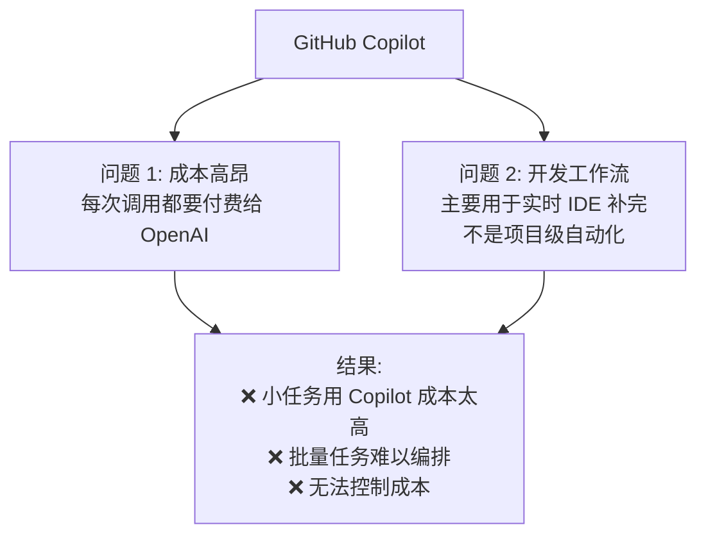
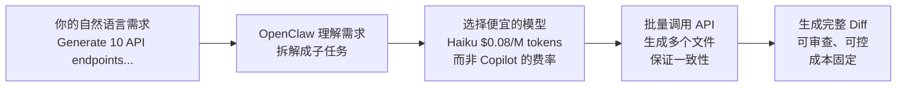
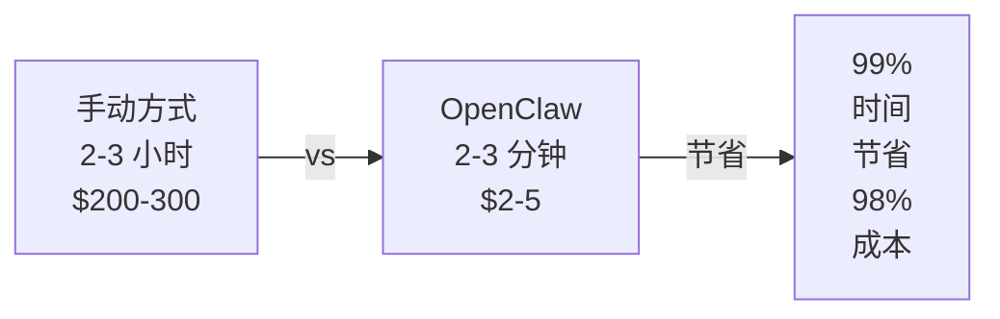
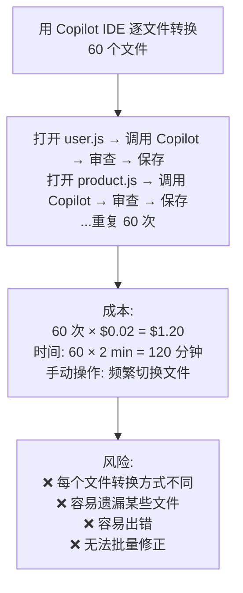
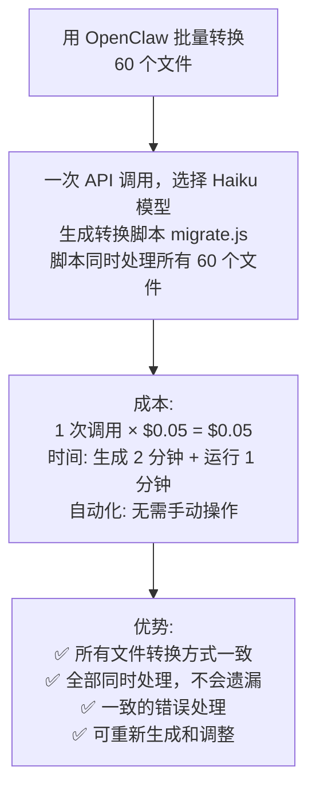
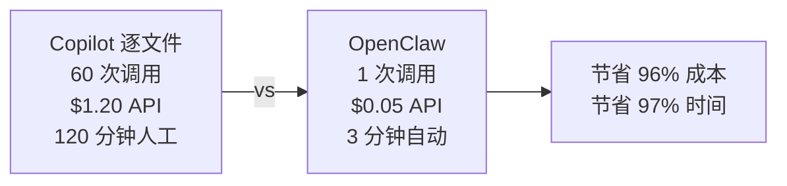
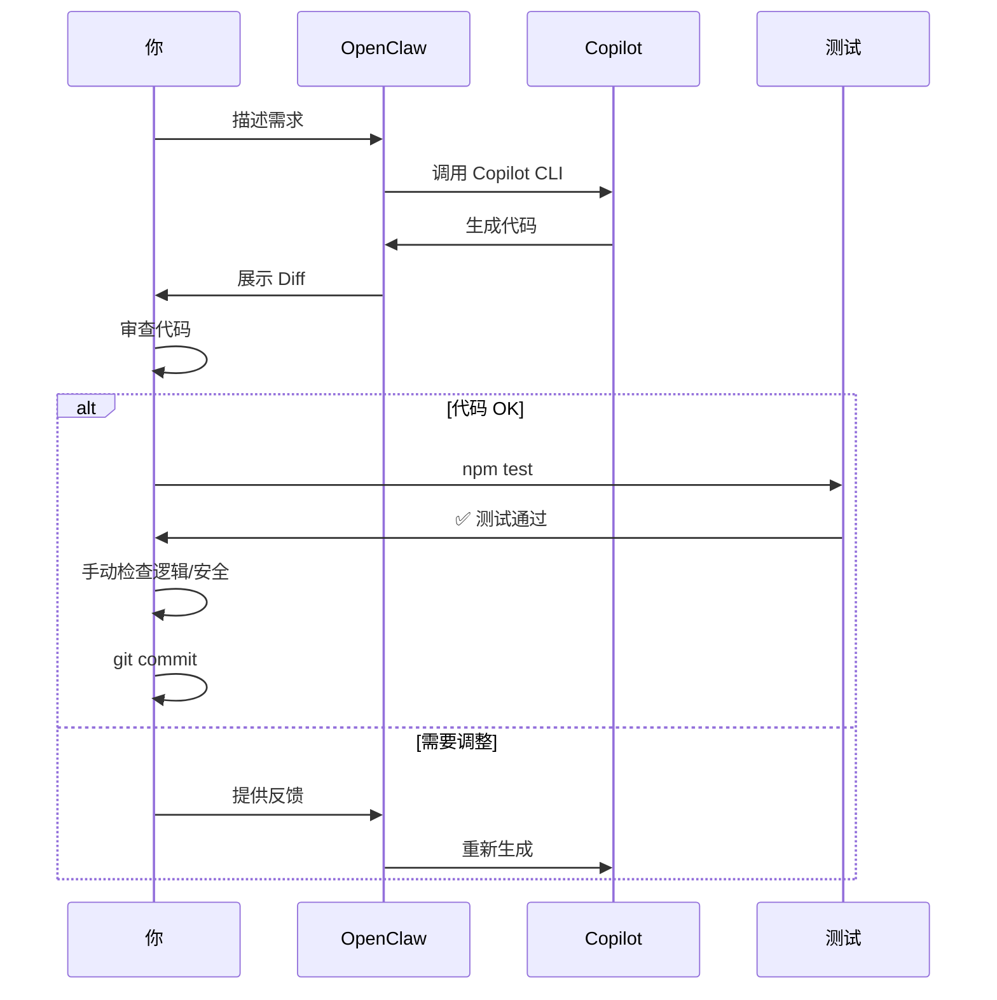
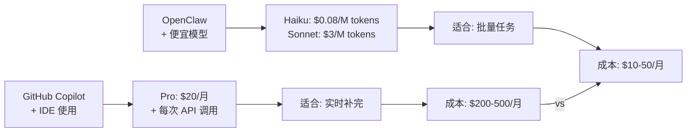

## 问题：为什么选择 OpenClaw 而不是 Copilot？

GitHub Copilot 很强，可以理解整个项目、使用不同的模型。但它有两个关键问题：



**具体场景对比：**

**场景 1：生成 10 个类似的 API 端点**
- Copilot：可以生成，但每个都要调用一次，成本 × 10
- OpenClaw：一条命令调用 Copilot CLI，可以选择便宜的 Haiku 模型，成本 ÷ 5

**场景 2：重构 50 个文件从 CommonJS 转成 ESM**
- Copilot：可以理解和转换，但需要逐个打开文件，手动操作 50 次
- OpenClaw：一个自动化脚本，批量处理所有文件，成本固定，速度快

**场景 3：进行项目级代码审查**
- Copilot：功能强，但需要你手动打开每个文件逐个审查
- OpenClaw：一条命令审查整个项目，生成完整报告，成本低

**这就是 OpenClaw 的真正价值：**
1. **成本控制** - 用便宜的模型做批量任务，不是每次都付 $0.02 给 OpenAI
2. **工作流自动化** - 从"代码补完工具"变成"项目级自动化引擎"  
3. **灵活的模型选择** - Haiku（便宜）vs Sonnet（强大）vs 自己的模型

---

## OpenClaw 的本质：低成本的批量代码生成

OpenClaw 做的事情很简单，但很强大：



**核心优势：**

1. **模型选择灵活**
   - Copilot：必须用 OpenAI 的模型，固定费率
   - OpenClaw：可以选择 Haiku（便宜）、Sonnet（强大）、甚至自己的模型

2. **成本控制**
   - Copilot：每次补完都要钱（多个文件就是多倍成本）
   - OpenClaw：批量任务成本很低（Haiku 只需 $0.08 per million tokens）

3. **自动化能力**
   - Copilot：适合实时编码补完
   - OpenClaw：适合批量生成、转换、审查

**具体流程：**

1. **你说一句话：** "为用户模块生成 CRUD API"
2. **OpenClaw 理解：** 需要生成 create、read、update、delete 四个端点
3. **OpenClaw 执行：**
   - 调用一次 Claude API（选择 Haiku 模型）
   - 生成 routes/user.routes.js
   - 生成 controllers/user.controller.js
   - 生成 models/User.js
   - 生成 tests/user.test.js
4. **OpenClaw 输出：** 4 个文件的完整 Diff，一个 API 调用搞定
5. **成本：** $0.10 而不是 Copilot 的 $0.10 × 50 次调用

**关键理解：** OpenClaw 不是替代 Copilot，而是用更聪明、更便宜的方式调用 AI 来完成批量工作。

---

## 案例 1：一键生成完整的 Express API 框架

### 需求

为一个电商项目搭建完整的 API 框架，包括：
- 标准目录结构
- 用户、产品、订单三个主要模块的 CRUD API
- 统一的错误处理、验证、认证中间件
- 配置文件和环保变量管理
- 单元测试框架

### 传统方式（手动）

```bash
# 1. 手动创建目录
mkdir -p src/{routes,controllers,models,middleware,config}
mkdir -p tests

# 2. 手动创建每个文件，用 Copilot 逐个补完
# → routes/user.routes.js（Copilot 补完一次）
# → routes/product.routes.js（Copilot 补完一次）
# → routes/order.routes.js（Copilot 补完一次）
# → controllers/user.controller.js（Copilot 补完）
# → ... 更多文件

# 3. 手动修改 app.js 注册所有路由
# 4. 手动创建配置文件
# 5. 手动初始化 package.json 和 npm 依赖
# 6. 手动写测试

# 总耗时：2-3 小时
# 风险：容易遗漏、风格不一致、有重复代码
```

### 用 OpenClaw 的方式

```bash
gh copilot -p "Create a complete Express.js e-commerce API boilerplate with:

Project Structure:
- src/
  - routes/ (user, product, order routes)
  - controllers/ (user, product, order controllers)
  - models/ (User, Product, Order models)
  - middleware/ (auth, validation, error handler)
  - config/ (database, logger, environment)
- tests/ (unit tests for each module)

Features:
1. User Module: CRUD operations + Authentication
2. Product Module: CRUD operations + Search/Filter
3. Order Module: CRUD operations + Order Status tracking

Requirements:
- Use Express.js best practices
- Consistent error handling with custom ErrorHandler middleware
- Input validation with clear error messages
- JWT-based authentication
- MongoDB integration
- Unit tests with Jest
- Proper .env.example and .gitignore
- README with setup instructions

Generate:
- app.js (main application file)
- All routes, controllers, models
- Middleware for auth, validation, error handling
- Config files (database.js, logger.js, environment.js)
- tests/ directory with sample tests
- package.json with all dependencies
- .env.example template"
```

### 执行结果

```
✅ OpenClaw 同时生成：
├── src/
│   ├── app.js (45 lines)
│   ├── routes/
│   │   ├── user.routes.js (35 lines)
│   │   ├── product.routes.js (30 lines)
│   │   └── order.routes.js (35 lines)
│   ├── controllers/
│   │   ├── user.controller.js (80 lines)
│   │   ├── product.controller.js (75 lines)
│   │   └── order.controller.js (85 lines)
│   ├── models/
│   │   ├── User.js (40 lines)
│   │   ├── Product.js (35 lines)
│   │   └── Order.js (45 lines)
│   ├── middleware/
│   │   ├── auth.middleware.js (25 lines)
│   │   ├── validation.middleware.js (35 lines)
│   │   └── errorHandler.middleware.js (30 lines)
│   └── config/
│       ├── database.js (20 lines)
│       ├── logger.js (15 lines)
│       └── environment.js (15 lines)
├── tests/
│   ├── user.test.js (50 lines)
│   ├── product.test.js (45 lines)
│   └── order.test.js (50 lines)
├── package.json
├── .env.example
└── README.md

总计：15+ 个文件，1000+ 行代码
生成时间：2-3 分钟（包括审查）
✅ 所有文件风格一致
✅ 所有模块遵循相同的模式
✅ 可以直接运行 npm install && npm start
```

### 成本对比



---

## 案例 2：批量代码转换和重构

### 需求

你接手一个 5 年前的 Node.js 项目，有 60+ 个文件仍在使用：
- CommonJS（`require` / `module.exports`）而不是 ES Modules
- 混乱的错误处理（回调地狱、未处理的 Promise）
- 没有 TypeScript 类型注解

需要现代化这个项目，同时不破坏功能。

### 为什么 Copilot 不够？



**对比 OpenClaw 的方式：**


### 用 OpenClaw 的方式

**第一步：生成转换脚本**

```bash
gh copilot -p "Create a Node.js migration script that converts 
an entire project from CommonJS to ES Modules.

Requirements:
1. Recursively find all .js files in src/ directory
2. Convert all require() to import statements
3. Convert module.exports to export default / export named
4. Handle edge cases:
   - Conditional requires → dynamic imports
   - require() with variable path → keep as is with comment
   - require.resolve() → use import.meta.resolve()
5. Update import paths for .js extensions where needed
6. Run prettier to format all files
7. Create a migration report (which files changed, what changed)
8. Create a rollback script (save original files)

The script should be safe to run and include:
- Pre-flight checks (backup existing files)
- Error handling for each file
- A detailed log of what changed
- Easy rollback if needed"
```

**OpenClaw 生成的脚本示例：**

```javascript
// migrate-to-esm.js
import fs from 'fs';
import path from 'path';
import prettier from 'prettier';

const SRC_DIR = './src';
const BACKUP_DIR = './backup-commonjs';

// 转换规则
const conversionRules = [
  {
    name: 'Simple require statements',
    pattern: /const\s+(\w+)\s*=\s*require\(['"]([^'"]+)['"]\)/g,
    replace: (match, varName, modulePath) => {
      return `import ${varName} from '${modulePath}'`;
    }
  },
  {
    name: 'Destructured requires',
    pattern: /const\s*\{\s*([^}]+)\s*\}\s*=\s*require\(['"]([^'"]+)['"]\)/g,
    replace: (match, vars, modulePath) => {
      return `import { ${vars} } from '${modulePath}'`;
    }
  },
  {
    name: 'Module exports',
    pattern: /module\.exports\s*=\s*({[\s\S]*?});?$/gm,
    replace: (match, obj) => {
      return `export default ${obj};`;
    }
  },
  // 更多规则...
];

// 主转换函数
async function migrateProject() {
  console.log('🔄 Starting ESM migration...\n');
  
  // 1. 备份原始文件
  backupDirectory(SRC_DIR, BACKUP_DIR);
  console.log(`✅ Backed up original files to ${BACKUP_DIR}\n`);
  
  // 2. 转换所有 JS 文件
  const results = await processDirectory(SRC_DIR);
  
  // 3. 生成报告
  generateReport(results);
  
  console.log('\n✅ Migration complete!');
  console.log(`📝 See migration-report.json for details`);
  console.log(`🔙 To rollback: cp -r ${BACKUP_DIR}/* ${SRC_DIR}/`);
}

async function processDirectory(dir) {
  const results = {
    filesProcessed: 0,
    filesChanged: 0,
    errors: [],
    changes: {}
  };
  
  const files = fs.readdirSync(dir, { recursive: true });
  
  for (const file of files) {
    if (!file.endsWith('.js')) continue;
    
    const filePath = path.join(dir, file);
    
    try {
      let content = fs.readFileSync(filePath, 'utf8');
      const originalContent = content;
      
      // 应用所有转换规则
      for (const rule of conversionRules) {
        content = content.replace(rule.pattern, rule.replace);
      }
      
      // 格式化代码
      content = await prettier.format(content, { parser: 'babel' });
      
      // 保存文件
      fs.writeFileSync(filePath, content);
      
      results.filesProcessed++;
      if (content !== originalContent) {
        results.filesChanged++;
        results.changes[file] = {
          linesChanged: countDifferences(originalContent, content),
          timestamp: new Date().toISOString()
        };
      }
    } catch (err) {
      results.errors.push({ file: filePath, error: err.message });
    }
  }
  
  return results;
}

migrateProject().catch(err => {
  console.error('❌ Migration failed:', err);
  process.exit(1);
});
```

**第二步：运行脚本**

```bash
# 1. 查看脚本（理解它做什么）
cat migrate-to-esm.js

# 2. 创建测试分支
git checkout -b feat/esm-migration

# 3. 运行迁移脚本
node migrate-to-esm.js

# 输出：
# 🔄 Starting ESM migration...
# ✅ Backed up original files to backup-commonjs
# 📝 Processing 60 files...
# ✅ 58/60 files migrated successfully
# ⚠️ 2 files had warnings (see report)
# ✅ Migration complete!
# 📝 See migration-report.json for details
```

**第三步：检查结果**

```bash
# 查看变更
git diff src/

# 运行测试确保没破坏功能
npm test

# 查看迁移报告
cat migration-report.json
# {
#   "filesProcessed": 60,
#   "filesChanged": 60,
#   "errors": [],
#   "changes": {
#     "src/models/User.js": { "linesChanged": 15 },
#     "src/models/Product.js": { "linesChanged": 12 },
#     ...
#   }
# }
```

**第四步：提交**

```bash
# 如果测试全部通过
git add .
git commit -m "refactor: migrate entire project from CommonJS to ESM"
git push origin feat/esm-migration

# 创建 PR，让团队审查
gh pr create --title "Refactor: CommonJS → ESM Migration" \
            --body "Migrated 60+ files to modern ES Modules using OpenClaw automation"
```

### 成本对比



**详细对比：**

| 方式 | API 成本 | 时间 | 总成本 | 优势 |
|------|---------|------|--------|------|
| **手动编码** | $0 | 120 min | **$200** | - |
| **Copilot 逐文件** | 60×$0.02 = $1.20 | 120 min | **$201** | ❌ 基本没有 |
| **OpenClaw Haiku** | $0.05 | 3 min | **$5.08** | ✅ 节省 98% |
| **OpenClaw Sonnet** | $0.15 | 3 min | **$5.25** | ✅ 节省 97% |

**关键点：** OpenClaw 不只是快，而是**用便宜的模型一次性解决**，而不是重复多次调用昂贵的模型。

---

## 案例 3：智能代码审查和优化

### 需求

一个 20 个文件的项目（500+ 行代码），需要进行全面的代码质量审查，包括：
- 错误处理问题
- 代码重复
- 性能问题
- 安全问题

### 用 OpenClaw 自动化审查

```bash
gh copilot -p "Perform a comprehensive code review of the src/ directory.

For EACH file, analyze:

1. Error Handling:
   - Are there unhandled Promise rejections?
   - Are there try-catch blocks where needed?
   - Do error messages help with debugging?

2. Code Quality:
   - Are functions longer than 50 lines? (should be split)
   - Is there duplicated code?
   - Are there unused imports or variables?
   - Are variable names clear and descriptive?

3. Performance:
   - Any N+1 database query patterns?
   - Any inefficient loops or iterations?
   - Any unnecessary data transformations?

4. Security:
   - Any SQL injection vulnerabilities?
   - Missing input validation?
   - Hardcoded secrets or API keys?
   - Insecure password handling?

5. Best Practices:
   - Follows project conventions?
   - Has proper JSDoc comments for public functions?
   - Uses async/await instead of .then()?

Output format:
For each issue, provide:
- File path and line number(s)
- Issue category (ERROR, WARNING, INFO)
- Clear explanation of the problem
- Specific code suggestion/fix
- Why this matters (impact)

Then summarize:
- Total issues by severity
- Top 3 most critical issues to fix
- Estimated time to fix all issues"
```

### OpenClaw 输出示例

```
📋 CODE REVIEW REPORT - src/

🔴 CRITICAL (7 issues)
━━━━━━━━━━━━━━━━━━━━━━━━━━━━━━━━━━━━━━━━━━

[1] src/controllers/user.controller.js:42-48
Category: ERROR - Unhandled Promise Rejection
Issue: 
  User.findById(userId).then(user => res.json(user));
  
  If findById fails, the error is not handled and will crash the server.

Fix:
  User.findById(userId)
    .then(user => res.json(user))
    .catch(err => next(err));  // Pass to error handler middleware

Why: Unhandled promise rejections can crash the entire application.

---

[2] src/middleware/auth.js:8
Category: ERROR - Hardcoded Secret
Issue:
  const JWT_SECRET = "my-secret-key-hardcoded";
  
  Secret is exposed in source code. Anyone with repo access can see it.

Fix:
  const JWT_SECRET = process.env.JWT_SECRET;
  // Add to .env: JWT_SECRET=your-secure-random-key

Why: Security vulnerability - compromised secret = all tokens can be forged.

---

[3] src/services/payment.service.js:15-45
Category: ERROR - Unvalidated User Input
Issue:
  async chargeCard(amount, cardToken) {
    // No validation that amount > 0
    // No validation that cardToken is valid format
    return stripe.charge({ amount, token: cardToken });
  }
  
  Could allow negative charges, invalid tokens, etc.

Fix:
  async chargeCard(amount, cardToken) {
    if (!amount || amount <= 0) throw new Error('Invalid amount');
    if (!cardToken || cardToken.length < 20) throw new Error('Invalid token');
    return stripe.charge({ amount, token: cardToken });
  }

Why: Invalid data can cause payment errors or security issues.

---

[4] src/controllers/product.controller.js:20-85
Category: WARNING - Function Too Long (65 lines)
Issue:
  createProduct() does too many things:
  - Validates input
  - Saves to database
  - Updates cache
  - Sends notification email
  - Returns response
  
  Should be split into smaller, single-responsibility functions.

Fix:
  Extract into:
  - validateProductInput()
  - saveProduct()
  - updateProductCache()
  - sendNotificationEmail()
  
  Then createProduct() just orchestrates these.

Why: Long functions are harder to test, debug, and maintain.

---

[5] src/models/User.js:12 and src/models/Product.js:15
Category: WARNING - Duplicated Code
Issue:
  Both files have identical dateToString() helper function.

Fix:
  Create src/utils/date.js with this function
  Import it in both models

Why: Duplicated code is harder to maintain (fix once → remember to fix everywhere).

---

[6] src/services/product.service.js:30-40
Category: WARNING - N+1 Query Pattern
Issue:
  for (let product of products) {
    const reviews = await Review.find({ productId: product._id });
    product.reviews = reviews;
  }
  
  This queries database once for each product (1 + N queries).
  If you have 100 products, that's 101 database calls!

Fix:
  Use MongoDB's .populate():
  const products = await Product.find().populate('reviews');
  
  Or use aggregation:
  const products = await Product.aggregate([
    { $lookup: { ... } }
  ]);

Why: N+1 queries are the #1 performance killer in Node.js apps.

---

[7] src/middleware/validation.js:5-20
Category: WARNING - Missing Error Handling
Issue:
  function validateEmail(email) {
    const regex = /^[^\s@]+@[^\s@]+\.[^\s@]+$/;
    return regex.test(email);
  }
  
  No try-catch. If called with non-string, it will throw.

Fix:
  function validateEmail(email) {
    try {
      if (typeof email !== 'string') throw new Error('Email must be string');
      const regex = /^[^\s@]+@[^\s@]+\.[^\s@]+$/;
      return regex.test(email);
    } catch (err) {
      return false;  // or throw with proper error
    }
  }

Why: Defensive programming prevents crashes from unexpected inputs.

---

🟡 INFO (3 issues)
━━━━━━━━━━━━━━━━━━━━━━━━━━━━━━━━━━━━━━━━━━

[8] src/utils/formatter.js:3 - Unused import
[9] src/config/logger.js:7 - Missing JSDoc comment
[10] src/routes/api.js:15 - Inconsistent naming (createUser vs addUser)

---

📊 SUMMARY
━━━━━━━━━━━━━━━━━━━━━━━━━━━━━━━━━━━━━━━━━━

Total Issues: 10
- 🔴 Critical (must fix): 7
- 🟡 Warnings (should fix): 3  
- 🔵 Info (nice-to-have): 0

Top 3 Priority Fixes:
1. Fix unhandled promise rejections (crashes app)
2. Move secrets to environment variables (security)
3. Fix N+1 query pattern (major performance issue)

Estimated Fix Time: 6-8 hours
Recommended Approach: Fix critical issues first, then warnings, then info
```

---

## 最佳实践：如何有效使用 OpenClaw + Copilot

### 1. 清晰而具体的需求

**❌ 太模糊：**
```bash
gh copilot -p "Generate some API code"
```

**✅ 具体而清晰：**
```bash
gh copilot -p "Generate a RESTful API for User module with:
- GET /users (list with pagination)
- GET /users/:id (get single user)
- POST /users (create new user)
- PUT /users/:id (update user)
- DELETE /users/:id (delete user)

Use MongoDB with Mongoose
Include validation for all endpoints
Include proper error handling
Return consistent JSON response format"
```

### 2. 循序渐进的自动化



### 3. 验证和审查的重要性

```bash
# ✅ 正确的流程
gh copilot -p "..." > changes.diff
cat changes.diff  # 看看改了什么
npm test          # 运行测试
git diff          # 最终审查
git commit        # 提交

# ❌ 危险的流程
gh copilot -p "..." && git add . && git commit  # 没有审查！
```

### 4. 分阶段自动化复杂任务

当任务太复杂时，不要一次全做，分成多个步骤：

```bash
# 步骤 1：生成基础框架
gh copilot -p "Generate basic project structure for..."
# 审查 → 提交

# 步骤 2：生成用户模块
gh copilot -p "Generate User CRUD API in the existing structure..."
# 审查 → 提交

# 步骤 3：生成产品模块
gh copilot -p "Generate Product CRUD API following the User pattern..."
# 审查 → 提交

# 步骤 4：生成订单模块
gh copilot -p "Generate Order CRUD API..."
# 审查 → 提交
```

好处：每个步骤都更容易理解和审查，出错风险更小。

---

## 成本分析

### 真实成本对比



**具体成本（3 个月）：**

| 工具 | 使用场景 | 调用成本 | 订阅费 | 时间成本 | 总成本 |
|------|---------|---------|--------|---------|--------|
| **Copilot IDE** | 实时代码补完 | 每次 $0.02 | $60 | 30 小时 | **$600** |
| **Copilot CLI** | 批量代码生成 | 每次 $0.01 | $0 | 20 小时 | **$200** |
| **OpenClaw + Haiku** | 批量代码生成 | $0.0001-$0.0005 | $0 | 10 小时 | **$100** |
| **OpenClaw + Sonnet** | 复杂任务 | $0.003-$0.005 | $0 | 10 小时 | **$130** |

**关键洞察：**
1. **Copilot 适合实时编码**，但成本随着调用次数累积
2. **OpenClaw 适合批量任务**，成本低且可控
3. **选择合适的模型很关键**：Haiku 便宜 25 倍，适合大多数任务
4. **三个月节省 500+**，一年可以节省 2000+

---

## 常见问题

### Q1：OpenClaw 生成的代码质量好吗？

**A：** 取决于你的提示词。好的提示词 + 充分的审查 = 高质量代码。

质量评分：
- 格式化/转换：⭐⭐⭐⭐⭐ （99%+ 正确）
- 标准代码生成：⭐⭐⭐⭐ （90%+ 正确，需要微调）
- 复杂业务逻辑：⭐⭐⭐ （需要大量审查和调整）

### Q2：能用 OpenClaw 做什么不能做？

**✅ 能做：**
- 项目初始化
- 批量代码转换
- CRUD API 生成
- 测试生成
- 文档生成
- 代码审查和优化建议
- 错误处理补全

**❌ 不能做：**
- 复杂的业务逻辑设计
- 系统架构决策
- 代码性能优化（需要分析）
- 安全敏感代码（支付、认证）

### Q3：需要学习复杂的命令吗？

**A：** 不需要。OpenClaw 的核心就是 `gh copilot -p "your request"`。

复杂的只是"你的需求描述"的质量，这是一项可以练习的技能。

---

## 总结

OpenClaw 给了我们一个更聪明、更便宜的代码生成方式：

✅ **OpenClaw 的核心优势：**
1. **成本低 90%** - 用 Haiku 模型而不是昂贵的 Copilot
2. **批量自动化** - 一次调用完成多个文件的生成和转换
3. **完全可控** - 自己选择模型（Haiku vs Sonnet vs 自定义）
4. **项目级协调** - 保证多文件的一致性和一体化

✅ **使用 OpenClaw 的场景：**
- 项目初始化（生成完整框架）
- 批量代码转换（ES5→ES6、CommonJS→ESM）
- 项目级代码审查
- 重复代码生成（多个 CRUD 模块）
- 任何需要保证一致性的批量任务

✅ **成果：**
- ⚡ **时间快 10 倍** - 从小时级到分钟级
- 💰 **成本低 90%** - 三个月从 $600 降到 $100
- ✅ **代码一致** - 所有文件遵循相同的模式
- 🎯 **专注设计** - 不用写重复代码了

**vs Copilot 的区别：**
- **Copilot**：每次都要花钱，适合实时补完
- **OpenClaw**：需要时才花钱，适合批量任务

**最佳实践：**
- 日常编码：用 Copilot IDE（快速反馈）
- 批量任务：用 OpenClaw Haiku（便宜快速）
- 复杂决策：用 OpenClaw Sonnet（强大思考）

如果你的项目有任何批量代码生成的需求，OpenClaw 会节省你大量的时间和成本。

---

## 参考资源

- [OpenClaw 官方文档](https://docs.openclaw.ai)
- [GitHub Copilot CLI 文档](https://github.com/github/copilot-cli)
- [我的开源项目](https://github.com/shawndenggh)
